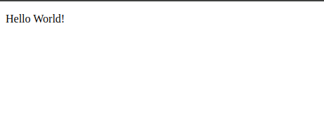
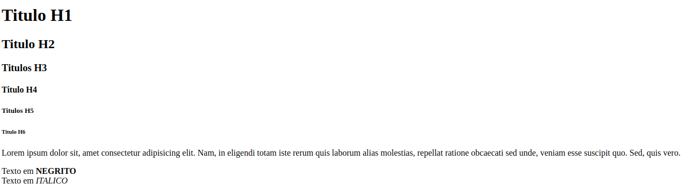
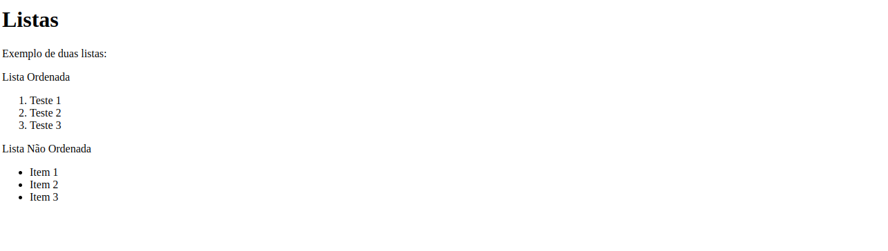
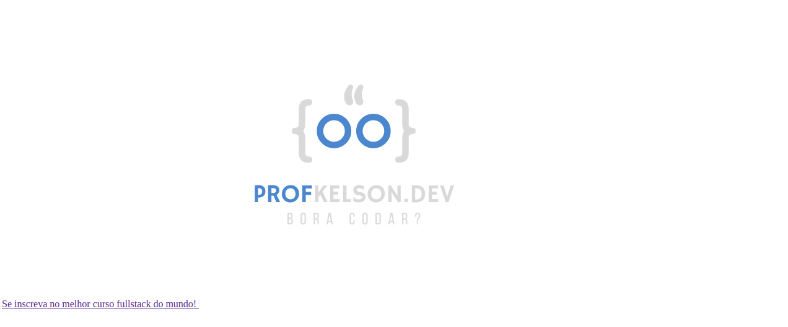
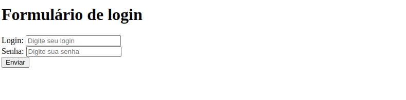
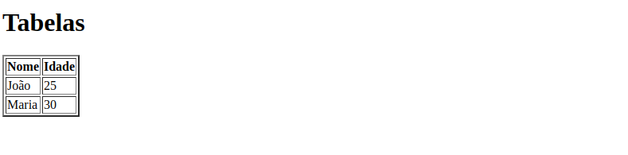
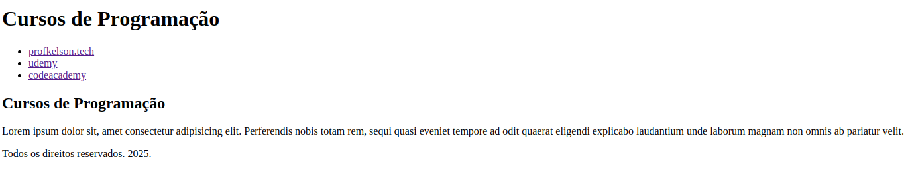
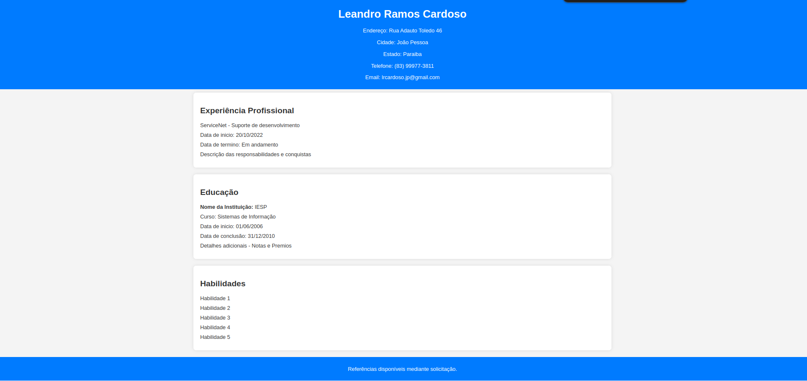
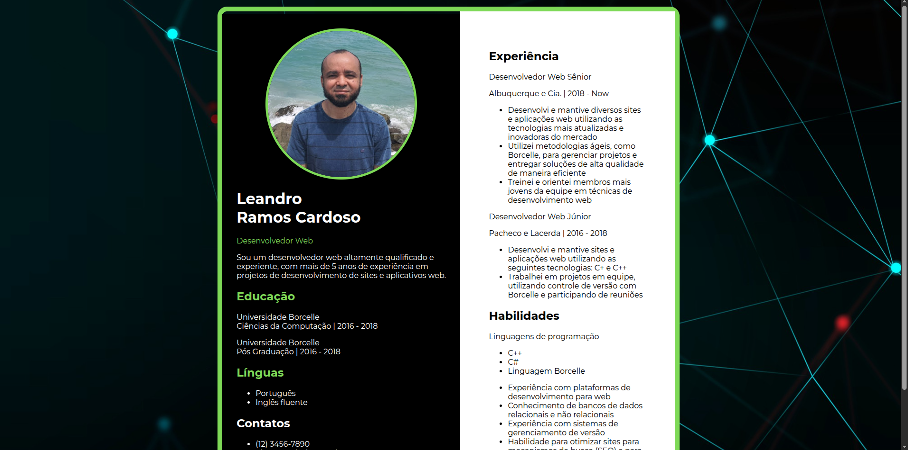

# 📌 Exercícios AULA 01

Este repositório contém os arquivos feitos no curso FullStack juntamente com as capturas de tela (prints) dos resultados dos arquivos desenvolvidos utilizando HTML e CSS.

## 🖼️ Capturas de Tela

> Abaixo estão os prints representando o resultado final de cada arquivo.html

  
📌 Exercício 01

  
  

  
📌 Exercício 02

  
  
  

  
📌 Exercício 03

  
  

  
📌 Exercício 04

  
  
  

  
📌 Exercício 05

  
  

  
📌 Exercício 06

  
  
  

  
📌 Exercício 07

  
  

  
📌 Exercício 08

  
  
  

  
📌 Exercício 09

  
  
  

---

| 🏆 Exercício | 📄 Descrição |
|-------------|------------|
| [Exercício 1](aula01/1_estrutura_basica.html) | Estrutura Básica do HTML |
| [Exercício 2](aula01/2_trabalhando_com_textos.html) | Trabalhando com textos |
| [Exercício 3](aula01/3_listas.html) | Listas |
| [Exercício 4](aula01/4_links_e_imagens.html) | Links e Imagens |
| [Exercício 5](aula01/5_formularios.html) | Formulários |
| [Exercício 6](aula01/6_tabelas.html) | Tabelas |
| [Exercício 7](aula01/7_elementos_semanticos.html) | Elementos Semânticos |
| [Exercício 8](aula01/8_desafio_cv.html) | Desafio Curriculum Vitae |
| [Exercício 9](aula01/9_desafio_cv2.html) | Desafio Curriculum Vitae Versão 2|

---

## 📁 Estrutura do Repositório

| 📂 Pasta  | 📄 Descrição |
|-----------|------------|
| `/aula??/` | Contém todos os arquivos `.html` referentes à cada aula. |
| `/css/` | Contém todos os arquivos de estilo da aula. |
| `/img/` | Contém todas as imagens utilizadas na aula 01. |
| `/img/prints/` | Contém as capturas de tela da página renderizada em diferentes dispositivos e tamanhos de tela. |

---

## 🚀 Tecnologias Utilizadas

 

---

## 👥 Autor
- **Leandro Ramos Cardoso** - [GitHub](https://github.com/leandro-ramos-cardoso)

